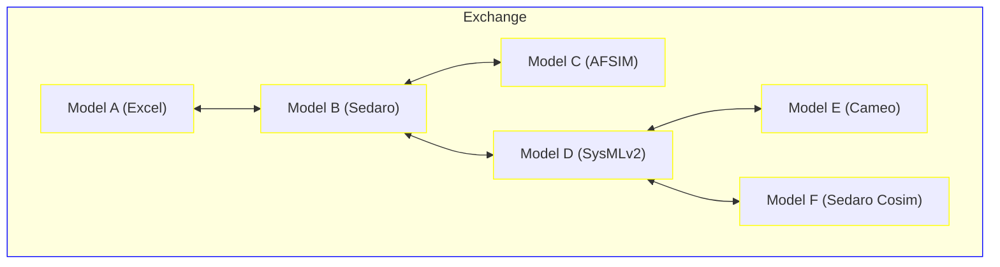
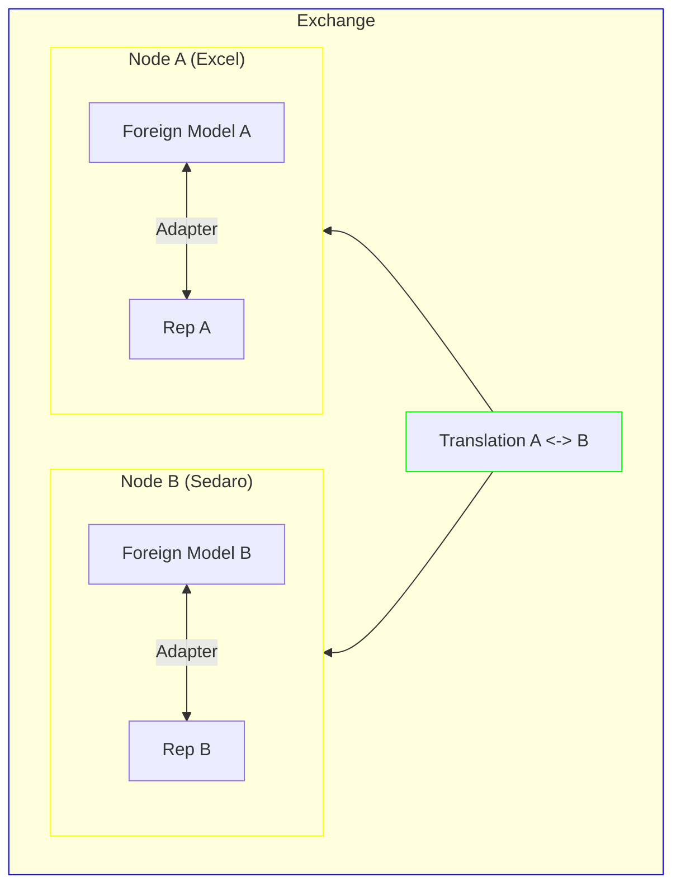
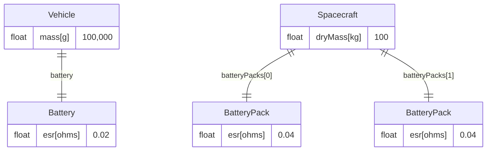

### Model Exchange (ModEx)

An open-source model translation framework powered by SedaroML and SedaroQL, written in Rust. Model Exchange enables flexible, multi-point exchange of model information between disparate tools that use disparate ontologies to represent - in part or in whole - similar information. 

### Motivation

Our experience building [Sedaro](https://sedaro.com) has solidified our belief that while new tools are needed in many areas, the massive value of model-based engineering (MBE) is primarily unlocked by connecting the previously unconnected, both between disciplines and across the engineering lifecycle. At face value, connecting data can seem relatively simple – particularly when considered alongside the complexity of modern systems - but in reality is a significant challenge.

MBE integration is exceptionally complicated. This is largely because a transition to MBE processes lies at the intersection of a disparate set of motives. Management wants enhanced productivity and efficiency from MBE. The customer wants better performing, more optimized systems. Finally, the engineers and operators (those primarily using these tools) typically want to do their job with the tools and processes that work for them, without this being dictated from outside of their discipline. However, these users also generally want better outcomes and fewer meetings, documents, and redundant/uninteresting tasks. These disparate motivations and perspectives lead to several difficult challenges for model integration.

This is where Model Exchange comes in.  ModEx facilitates an organic evolution of large-scale, authoritative synthetic environments through integration of existing tools, adoption of new tools and data sources, and streamlined, flexible process automation.  The beauty of this easy, flexible interoperability is that a transition towards model-based engineering tooling and processes can be driven increasingly from the bottom up (i.e., users) and not from top down (i.e., management).

### Key Concepts

#### Future-Proof Translation Framework

Model Exchange takes a model-based approach to interoperability, resulting in end-user interfacing software that is maintainable and tractable over long periods of time.  Too often is a one-off "glue" layer written in order to connect two tools together, only for it to become obsolete or unstable as the interfaces on either end of the "glue" evolve with time.  The ModEx framework handles all the annoyances and complexities of model interoperability like model initialization, change detection, conflict detection and resolution, and concurrency so that you can focus on the important stuff.  Its robust and future-proof approach to interface model development allows an Exchange to remain flexible and responsive to changes both upstream and downstream.

#### Decentralized Translation Network

Model Exchange follows a decentralized approach to the interfacing problem where translations between models (or "Nodes") in the Exchange can be chained off any other Node.  In other words, there is no central "hub" that all translations must pass through.  This means that no rework is required to any existing translations and Nodes within an Exchange in order to integrate a new model.  It also means that if you already have a Translational model written and tested for a mapping `D <-> F`, you can easily plug model `F` into the Exchange because `D` already exists within the Exchange network. This approach is fundamental to driving the composability of Model Exchange components into application specific Exchanges.



In this decentralized translation network, if a change were to be detected in model `C`, the change will be propagated to all other models within the network via the existing Translational mappings.  Optimizations are also possible such that if a change to `C` causes `B` to change but the Translational model `B <-> D` doesn't results in changes to `D`, `E` and `F` will remain untouched.

#### Model Adapters

In Model Exchange, all models exist in a common intermediate representation (IR).  A simple adapter is written to convert a foreign model representation to and from the IR.  Model Exchange ships with many built-in adapters:

- Excel
- Magicdraw/Cameo Systems Modeler (SysML)
- SysMLv2 (coming soon)
- AFSIM
- [Sedaro](https://sedaro.com)
- Sedaro Cosimulation

**Important Note:** The goal of a Model Adapter within an Exchange is only to represent a foreign model in the IR.  It isn't to translate the foreign model to a different ontology within the IR.  While developing a Model Adapter, the existing ontology of the foreign model should be maintained in order to leave the translation (and all of its complexities) up to the Exchange.  Model Adapters should also be written such that they should not need to be updated as the foreign model changes.  They should simply traverse the model and deterministically produce a resulting IR. 

#### Language Agnostic

One motivation for writing Model Exchange in Rust is the languages ability to interface with other ("foreign") languages.  Rust's `std::ffi` module exposes utilities for constructing foreign function interface (FFI) bindings between Rust projects like Model Exchange and other languages like Python, Java, C++, etc.  This allows for the development of Model Adapters in nearly any language.  See the [Excel Node](./src/nodes/excel.rs) for an example of how to write a Model Adapter in Python.

#### Model Representations

There are 3 key model representation types used within an Exchange:

1. Ontological: A representation that defines the properties and relationships of a model.
2. Usage: A representation that defines how an Ontological model is used in a particular context.
3. Translational: A Usage model that represents the bidirectional mapping between two Ontological/Usage model pairs.

##### Introduction to SedaroML

The open-source Sedaro Modeling Language (SedaroML) is used as the intermediate representation (IR) for models in an Exchange due to the languages approachability, flexibility, and available tooling.  

SedaroML defines system properties and structure as normalized, interrelated, and hierarchical blocks of attributes. SedaroML is JSON-based and is designed to be easily human and machine readable/writeable. This includes model interpretation, traversal, etc.  Sedaro is editable as JSON in any text editor or within Sedaro Blueprint.

SedaroML is also queryable via the open-source Sedaro Query Language (SedaroQL) which is particularly powerful in the ModEx use-case as it enables the definition of flexible, reversible, and easily maintained Translational mappings between input and output models.  Support for SedaroQL is a key enabler of future-proof translations in the ModEx Framework.

Another advantage to using SedaroML is its seamless integration with the ever-growing Sedaro open-source ecosystem of tools, content, and services.

#### Testability

Model Exchange makes the development of test suites for your model translations easy and efficient.  The framework provides a simple way to define test cases for model translations and to run these tests in a repeatable and automated way.  This is critical for ensuring that translations are correct and that they remain correct as the models and the translation logic evolve.

### Architecture

The Model Exchange framework has opinions on how best to architect and organize interoperability software with out of the box solutions to all of the common headaches and points of friction.  The framework is designed to be flexible and extensible to meet the needs of a wide range of applications and use-cases.

An `Exchange` is composed of `Nodes` and `Translations`.  A `Node` wraps a distinct model and exposes a SedaroML representation (or `Rep`) to the `Exchange` for `Translations` to read from and/or mutate.  Each `Node` has a string `identifier` that uniquely identifies it within the Exchange.  In cases where a Model Adapter is used, a thread can be spawned within the `Node` to perform change detection on the "foreign" model and reconcile changes between it and its `Rep`.



A `Translaton` is how two `Nodes` are networked together within an `Exchange`.  Each `Translation` is composed of `Operations`.  Today an `Operation` is a pair of functions (`forward` and `reverse`) which take a immutable `from` `Rep` and a mutable `to` `Rep`.  These functions may read `from` in order to mutate `to`.  In the example above, if `A`'s foreign model were to change, each `forward` `Operation` of `Translation A <-> B` would be executed with `Rep A` passed as `from` and `Rep B` passed as `to`.

**Note:** Cycles are not supported in the Exchange translation network.

Coming soon to Model Exchange is an upgrade to `Operations` where instead of writing code, engineers write SedaroQL queries to define the forward mapping from one `Node` to another.  These queries will compile to forward and reverse `Operations` that can be executed by the Exchange.  This capability will shortly follow the release of SedaroQLv2 in Sedaro 4.16 and will support translation between ontologically different models such as those depicted below.



In order to map `A` (left) to `B` (right), a Model Exchange developer could write a flexible query such as:

```python
# A -> B
block!(name='spacecraft_dry_mass').value -> Spacecraft.dryMass,
block!(name='spacecraft_battery_esr').value -*> Spacecraft.batteryPacks.esr
```

where, in the first expressions, the units of `block!(name='spacecraft_mass').value` and `Spacecraft.dryMass` are inferred from the SedaroML representation of each model and the value is simply copied from one model to the other after a unit conversion from grams to kilograms; and in the second expression, the query engine multiplies the ESR value from `A`'s `block!(name='spacecraft_battery_esr').value` parameter by the number of battery packs in the target model to effectively translate the properties of `A` to `B`, despite their ontological differences.

Within the Exchange, this query is then **automatically** reversed to map `B -> A` as:

```python
# B -> A
Spacecraft.batteryPacks.esr /-> block!(name='spacecraft_battery_esr').value,
Spacecraft.dryMass -> block!(name='spacecraft_mass').value
```

To demonstrate the power of query-based Translational model definitions, consider the example where a third battery pack is added to the `Spacecraft` model (model `B`) above.  In this case, the Exchange would detect the addition of the new Block and the updated `esr` values and use the reverse `Operation` to reconcile the changed in the reduced order model `A`.  Here the Exchange is responsive to significant model changes without the need for manual intervention.  It all just works.

Its important to note that the query language is far more capable than what is demonstrated above such that more complicated translations can be defined.  In the cases where a query cannot be reversed, an error will be raised and the user will be required to define a reverse query.

### ModEx Status

Model Exchange is in active devlopment.  Today, support for SedaroQL-based Translational models is not yet available.  During Exchange start-up, conflict detection and resolution between a "foreign" model and its local IR is implemented but conflict detection and resolution between different models in an Exchange is not yet implemented.

### Quick Start

```rust
use modex::model::sedaroml::Model;
use modex::nodes::sedaro::{Sedaro, SedaroCredentials};
use modex::nodes::excel::Excel;
use modex::exchange::Exchange;
use modex::translations::{Operation, Translation};


#[tokio::main]
async fn main() {
  
  // Instantiate Nodes
  let excel_node = Excel::new(
    "Excel Power Model".into(), 
    "test.xlsx".into()
  );
  let sedaro_node = Sedaro::new(
    "Wildfire Spacecraft Digital Twin".into(),
    "https://api.sedaro.com".into(),
    "PNdldNPBmJ2qRcYlBFCZnJ".into(),
    SedaroCredentials::ApiKey("YOUR API KEY".into()),
  );

  // Define Operations
  let excel_to_sedaro = Operation {
    name: Some("-".into()),
    forward: |from: &Model, to: &mut Model| {
      let battery_esr_name = from.get_block_by_name("battery_esr").expect("Block not found.");
      let esr = battery_esr_name.get("value").unwrap().as_f64().unwrap();
      to.block_by_id_mut("NT0USZZSc9cZAmWJbClN-").expect("Block not found").insert("esr".to_string(), esr.into());
      Ok(())
    },
    reverse: |from: &Model, to: &mut Model| {
      let block = from.block_by_id("NT0USZZSc9cZAmWJbClN-").expect("Block not found");
      let esr = block.get("esr").unwrap().as_f64().unwrap();
      let battery_esr_name = to.get_block_by_name_mut("battery_esr").expect("Block not found.");
      battery_esr_name.insert("value".to_string(), esr.into());
      Ok(())
    },
  };

  // Define Translations
  let translation = Translation {
    from: excel_node.clone(),
    to: sedaro_node.clone(),
    operations: vec![excel_to_sedaro],
  };

  // Start the Exchange
  let exchange = Exchange::new(vec![translation]);
  exchange.wait();
}
```

### Install

1. Install Rust: https://www.rust-lang.org/tools/install
2. `cargo build`

### Run

1. Configure python environment (optional - required if using Excel connector)
```
python -m venv .venv
source .venv/bin/activate
export PYTHONPATH=./
```
2. `cargo run`


### Examples

See our [examples](./examples) for various Model Exchange configurations and use-cases.  Note that you may need a paid license to certain software tools (Excel, Cameo, AFSIM, etc.) to run several of the examples.